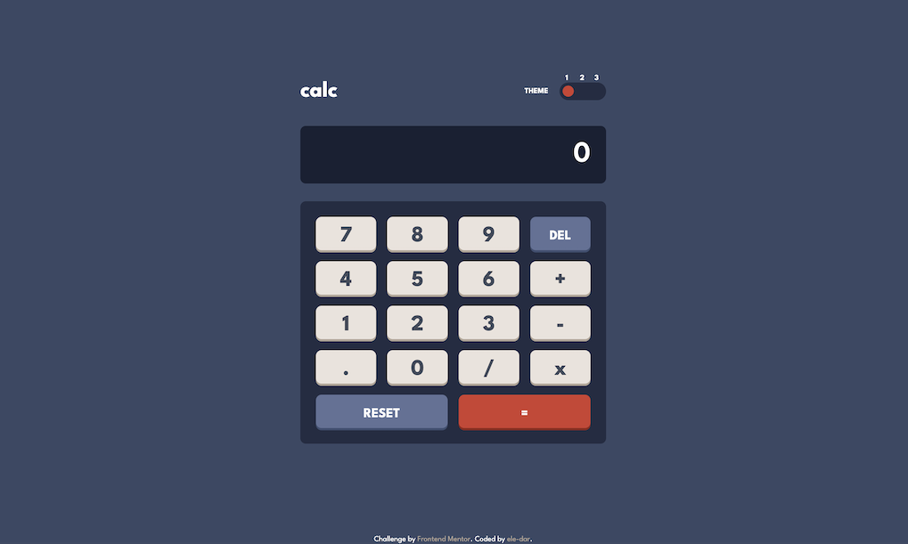
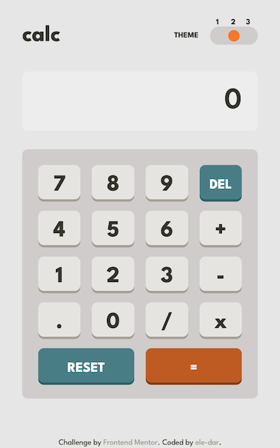

# Calculator app

This is a solution to the [Calculator app challenge on Frontend Mentor](https://www.frontendmentor.io/challenges/calculator-app-9lteq5N29).

## Overview

### Features

- Calculator performs mathematical operations: addition, subtraction, multiplication, and division
- Users can choose between three color themes. 
- The app loads with a light or dark theme according to the user's color scheme preference (`prefers-color-scheme`) and its changes are respected. However if a user chooses a theme with a toggle, the choice is maintained during the session.

### Link

- Try it out here: [https://ele-dar.github.io/calculator-app/](https://ele-dar.github.io/calculator-app/)

### Screenshots

Desktop view in dark mode:

Mobile view in light mode

## My process

### Built with

- Semantic HTML5 markup
- CSS custom properties
- Flexbox
- CSS Grid
- Mobile-first workflow

### What I learned

I took up this challenge with the intention of putting my knowledge of plain JavaScript to a test. Also, this was my first attempt to add color theming to a project. 

### Continued development

In the future, I would like to improve the calculator algorithm, as it has some drawbacks. I would also like to explore other ways of implementing color theming.

### Useful resources

- [Tristate toggle](https://dev.to/sanaz/tristate-toggle-switch-509n) - This helped me build a tri-state toggle theme switch.
